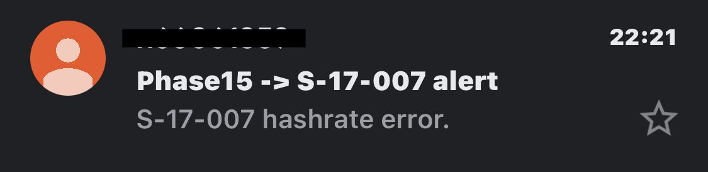

# GPUMine_monitor

透過GPUMine API檢查礦機是否出現掉卡(*算力降低超過設定值的10%*)，如果出現則透過Email通知
<br>
<br>
<br>
## Getting start
1. 取得Gmail 應用程式密碼供python使用 [如何取得](https://support.google.com/accounts/answer/185833)
2. 創建及設定 config.json

```json
{
    "mailAccount" : {
        "sender" : "Your_Email_Address",
        "applicationPassword" : "Google_Application_Password",
        "recipients" : ["recv_1@email", "recv_2@email"]
    },

    "miner":{
        "Miner1_Name" : {
            "wallet" : "ETH_wallet_Address",
            "workers" : {
                "Worker_Name_1" : "worker's hashrate -> int",
                "Worker_Name_2" : 420,
                "Worker_Name_3" : 180 
            }
        },
        "Miner2_Name" : {
            "wallet" : "ETH_wallet_Address2",
            "workers" : {
                "Worker_Name_1" : 300,
                "Worker_Name_1" : 250
            }
        }
    }
}
```

3. 執行
```bash
python3 main.py
```

4. 希望都不要看到



## Reference
[透過python寄email](https://www.learncodewithmike.com/2020/02/python-email.html)